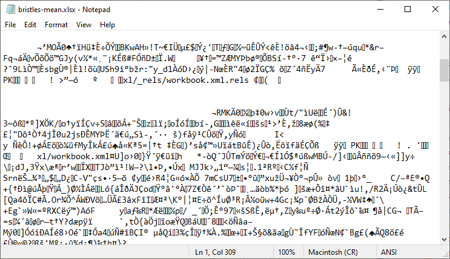
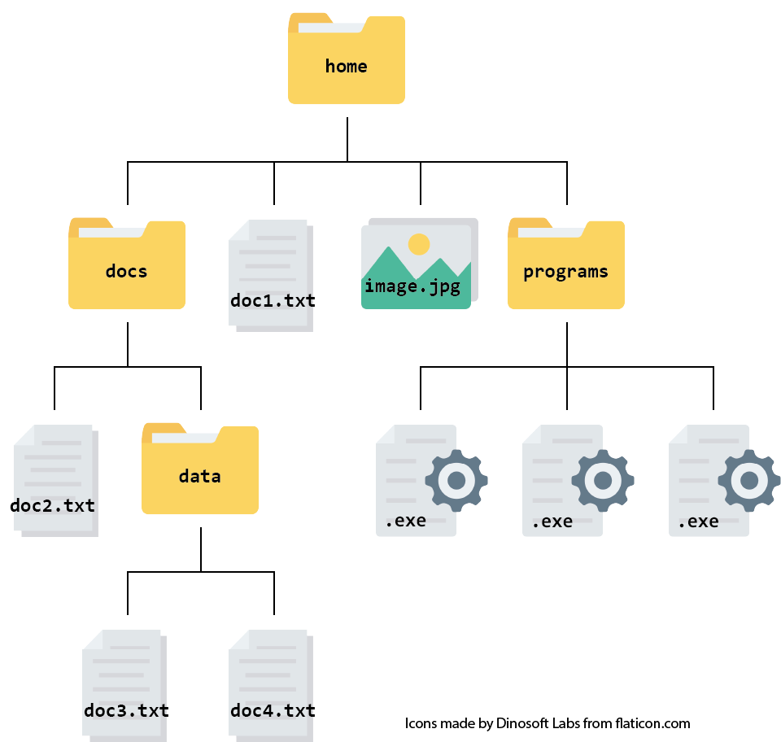
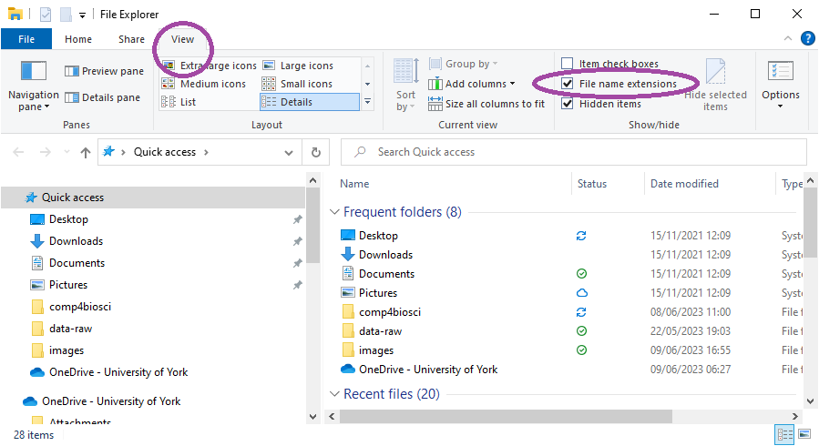
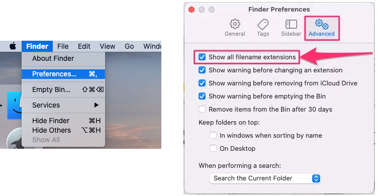
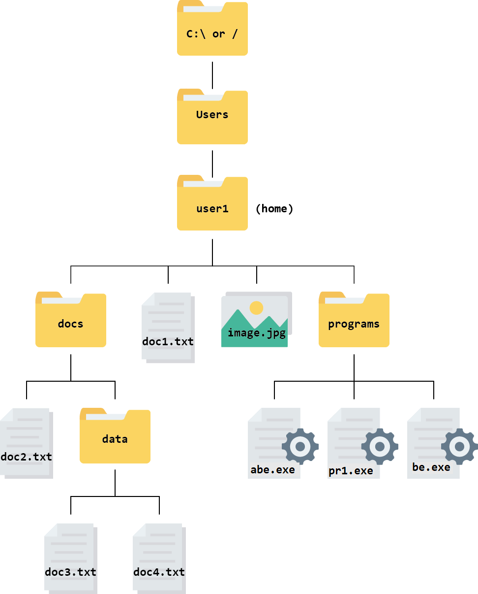

# What they forgot to teach you about computers

## Why "What they forgot"?

Most students grew up with the presence of digital technology and are
thought to be comfortable with, and fluent in, technology. But for many,
this fluency is with using tablets and smart phones and these are
different to computers. Several studies have shown that the increased
reliance on of tablets and smartphones makes people highly proficient at
online communication but hampers the development of other computing
skills [@drossel2017;
@australiancurriculumassessmentandreportingNationalAssessmentProgram2014].

This chapter tries to teach the computer skills that you might have
missed if you have used mainly the mobile devices. I focus on the
knowledge gaps that often appear when people are learning computational
data analysis. Primarily these are to do with finding and organising
their files and folders in the file systems.

If you often use a computer for tasks like organising files and writing
documents and spreadsheets much of this chapter might be familiar.
However, if you have mainly used your mobile phone and tablets to access
the internet then reading all of it will be helpful. The first chapter
briefly explains why a computer rather than a tablet is most useful for
a science degree and what an operating system is. The second chapter
some essential concept for scientific computers: file system
organisation, file types, working directories and paths. Most people
joining a bioscience degree programme are not familiar with the concept
of working directories but will find learning data analysis much easier
once they pick up this knowledge.

## Computer or tablet?

Computers (laptop or desktop) and tablets can both be useful for doing a
science degree but if you have to choose just one, I would recommend a
computer. This is because

1.  Computers typically offer more processing power, storage capacity,
    and flexibility for running complex software all of which are
    important in science.

2.  Scientific and academic software often cannot be installed on
    tablets - at least not easily.

3.  Your institution most likely has a networked computer system with
    computers that you use in taught workshop and which are available to
    you throughout your degree. Many people find it easier to use a
    similar computer at home so they can follow instructions from the
    workshop exactly to continue the work at home

4.  We often need to multitask and use several programs at once. The
    greater power and screen size of a computer usually makes this
    easier.

Tablets are more portable and have touch-screens and stylus support and
this makes them easier to use for note taking in lectures and annotating
documents. Some laptops also have touch-screens but they can be
expensive. Overtime computers will adopt more of the advantages of
tablets and tablets will adopt more of the advantages of computers.

## What is an operating system?

Every computer or mobile device has an operating system (OS) which
controls how all the other software on a computer interacts with the
computer hardware. You may already have a preference for a particular
OS. An OS starts up the computer, manages the memory and all the
processes, and controls all the devices connected to the computer. As a
consequence, all the other software on a computer has to be able to work
with the operating system installed.

Most people do not install the operating system but buy their machine
with it pre-installed.

## Types of operating system

### Microsoft Windows and Apple macOS

Windows and Mac are the two most widely used OS on personal computers.
Windows is developed by Microsoft and licensed to a multitude of PC
manufacturers, which accounts for its ubiquity on desktops and laptops
from Dell to Lenovo.

By contrast, macOS is proprietary software that runs exclusively on
Apple’s own hardware. The tight integration across Apple’s ecosystem
means that features "just work" when you switch between your Mac,
iPhone, and iPad.

You might already have had - or seen - a Mac versus Windows debate but
in reality it is down to preference for most users. If you already have
experience with one, you will probably prefer to keep using it but if
you are buying for the first time, I recommend using the same as your
institution uses. This makes it more likely that instructions for taught
material will just work on your machine and more likely that people
around you will be able to help.

One difference between Windows and Mac machines most noticed by users is
the different names for some useful keys. Table @tbl-key-board gives
some of these.

| Windows key | macOS key   |
|-------------|-------------|
| Enter       | Return      |
| Ctrl        | ⌘ (Command) |
| Alt         | ⌥ (Option)  |

: Keyboard equivalents for Windows and Mac {#tbl-key-board}

When using RStudio, the section [@sec-keyboard-shortcuts-tips] on Keyboard Shortcuts should help you translate between the two if needed.

### Linux

Linux offers a very different philosophy: it is not a single OS but a
family of open‑source systems built around the Linux kernel, which Linus
Torvalds first released in 1991. Anyone may inspect, modify, or
redistribute the source code under licenses such as the GNU General
Public License. Linux is often used for high-performance and scientific
computing where workflows are script- rather than menu-driven and the
user interacts with the system through a command line.

## Understanding file systems {#sec-file-systems}

A file system is made up of files and folders organised in a
hierarchical way. Understanding file types and being able to navigate
your computer's file system and purposefully organise and manipulate
files are essential computational skills. We will first talk about
different file types before covering their organisation in a file
system. This will lead us on to the concepts of working directories and
paths. It is hard to overstate how useful an understanding of working
directories and paths are for comfortable computing. Without this
understanding, you can write basically correct code, such as for
importing data, which will not work because you don't know how to tell
the computer where the file is.

## Files {#sec-file-systems-files}

A file is a unit of storage on a computer with a name that uniquely
identifies it. Files can be of different types depending on the sort of
information held in them. The file name very often consists of two
parts, separated by a dot:

-   the name - the base name of the file

-   an extension that should indicate the format or content of the file.

Some examples are report.docx, analysis.R, culture.csv and readme.txt.
There is a relationship between the file extension and the file type

## Plain text files

One of the simplest types of file is a "text file", also known as ASCII
files, which contains only text characters and no formatting, images or
colours. Text files have many different extensions to indicate what the
text content represents. A few of these are given in
@tbl-text-file-extensions.


::: {#tbl-text-file-extensions}

```{r}
#| echo: false

ext <- data.frame(ext = c(".txt", ".tab", ".csv", ".R", ".py", ".fasta"),
                  content = c("Could be any kind of text, including data", 
                              "Values, often data, separated by tabs", 
                              "Values, often data, separated by commas",
                              "R commands and comments",
                              "Python commands and comments",
                              "Nucleotide or amino acid sequences"))

knitr::kable(ext,
             col.names = c("Extension", "Content usually inside")) |> 
  kableExtra::kable_styling()

```

Some common text file extensions and the content the extension usually indicates.


:::

Plain text files are extremely portable which means they can be opened
on any computer by a very large number of programs. Simple text editors
which exist on any system like Windows Notepad or Mac's TextEdit will
open text files where as they will not open program-specific files like,
for example, .xlsx (Excel) or .docx (Word) files (@fig-xlsx-in-notepad).
It is usually easy for application designers to make an application
manage plain text files. This means


:::{#fig-xlsx-in-notepad}



**How an Excel file looks if you open it with Notepad.** Notepad will 
open an Excel file but the contents are a mess of strange
characters and the content is unreadable. This is because Excel 
files are not plain text files.

:::

Data is commonly held in text files because of their portability.

## Plain text files with markup

Text files can also include "markup" which are text characters used to
annotate text to control how it is displayed or processed. Such files
retain their portability and are human readable. You will have used them
often! (@tbl-mark-up-text-file-extensions)


::: {#tbl-mark-up-text-file-extensions}

```{r}
#| echo: false

ext <- data.frame(ext = c(".html", ".md", ".Rmd", ".JSON", ".tex", ".qmd"),
                  content = c("Hypertext Markup Language - for documents 
                              designed to be displayed in a web browser.", 
                              "markdown - a lightweight markup language 
                              designed to be human readable", 
                              "R markdown - like markdown but can include R 
                              code", 
                              "JavaScript Object Notation - commonly used for 
                              transmitting data in web applications using 
                              attribute-value pairs.",
                              "TeX - a typesetting langauge especially where 
                              the writer needs precise spacing and/or unusual 
                              fonts and characters such as in maths, linguistics
                              and music.",
                              "Quarto markdown - next-generation version of R 
                              Markdown designed to work with *any* programming 
                              langauge."))

knitr::kable(ext,
             col.names = c("Extension", "Used for")) |> 
  kableExtra::kable_styling()

```

Some common markup file extensions and the content the extension usually indicates

:::

## The relationship between file extensions and programs

Whilst a file extension is intended to indicate the content and format,
it is important to remember a few things. The extension is just part of
the name and it is certainly possible to called a file `myfile.csv`
without its contents being formatted as comma-separated values. Programs
vary in their behaviour to file extensions. Most text editors will
attempt to open any file regardless of the extension and make it
possible to save a file with any extension. In program like MS Word you
cannot save a Word format file with any extension other than `.docx`,
you can only save it in another format to change the extension. Some
programs will not open fies with a the wrong extension even if the
contents are in the correct format.

## File systems

In a file system, the files are organised into directories. Directory is
the old word for what many now call a folder but commands that act on
folders in most programming languages and environments reflect this
history

For example, all of these mean "tell me my working directory":

-   `getwd()` **get** **w**orking **d**irectory in R
-   `pwd` **p**rint **w**orking **d**irectory on Linux
-   `os.getcwd()` **get** **c**urrent **w**orking **d**irectory in
    Python

Consequently it is common to use the the word directory in scientific
computing.

Folders can contain sub-folders, which can contain their own
sub-folders, and so on almost without limit.

It is easiest to picture a file system, or part of it, as a tree that
starts at a directory and branches out from there. This is called a
hierarchical structure. @fig-file-system shows an example of a
hierarchical file structure that starts at a directory called `home`:

::: {#fig-file-system}




**A file hierarchy containing 4 levels of folders and files.** At the 
top level there is a directory called `home/`; Inside `home/` are two 
directories (`docs/` and `programs/`) and two files `doc1.txt` and 
`image.jpg`. Inside `docs/` there is a file called `doc2.txt` and a 
directory called `data/` which contains `doc3.txt` and `doc4.txt`. 
Inside `programs/` are three `.exe` files.
Figure adapted from [@randemma2022]
:::

## Using a file manager

File managers are the basic way that you interact with the file system
on your computer. They allows you to move, copy, and delete files. You
can also launch applications from them and and connect to other
networks. The windows file explorer is called File Explorer and on Mac
it is called Finder (@fig-explorer-icons).

::: {#fig-explorer-icons layout-ncol="2"}
{#fig-windows-explorer
width="100"}

{#fig-mac-finder
width="100"}

**File manager programs in Windows and Mac**
:::

Windows Explorer and Mac Finder do not show the file extensions on file
names by default but I find it helpful to be able to see them. You can
show the file extensions like this:

-   under View, in the Show/hide group, select the "File name
    extensions" check box @fig-show-extensions-windows

-   choose Finder \| Preferences \| Advanced then check "Show all
    filename extensions" box @fig-show-extensions-mac

::: {#fig-show-extensions layout-nrow="2"}
{#fig-show-extensions-windows}

{#fig-show-extensions-mac}

**Showing file extensions in Windows and Mac.** 
@fig-show-extensions-windows In Windows, open Windows Explorer. Under 
View, in the Show/hide group, select the "File name extensions" check 
box.  @fig-show-extensions-mac In Mac, choose Finder \| Preferences 
\| Advanced then check "Show all filename extensions" box.

:::

## Root and home directories

The top-level of directory on a computer system is known as the "root
directory". The root is represented as a `/` in Mac and Linux operating
systems. In Windows the root directory is also known as a drive. In most
cases, this will be the `C:\` drive.

Even though the root directory is at the base of the file tree (or the
top, depending on how you view it), it is not necessarily where our
journey through the file system starts when we launch a new session on
our computer. Instead our journey begins in the so called "home
directory". You home directory is not usually named `home` but with your
username for that computer. Your personal files and directories can be
found inside this folder. This is where your computer assumes you want
to start when you open your file manager. On Windows and Mac your home
directory is a directory *inside* the directory called `Users`
immediately under the root and named with your username
(@fig-file-system-root).

::: {#fig-file-system-root}



**The hierarchy of a file system from the root**. The top level is `C:\` 
in Windows and `/` in Mac. Below that is the Users directory which 
has a folder for each user. Your home directory is named with your 
username inside the Users folder. Figure adapted from
[@randemma2022].

:::

There will be other folders immediately below the root directory (on the
same level of the hierarchy as `Users`). These contain system-level
files and folders that you do not usually needed to open, edit or move.
For example, `Program Files` is where programs are installed.

## Working directories {#sec-file-systems-files-working-directories}

The working directory of a program is the default location a program is
using. It is where the program will read and write files by default. You
have only one working directory at a time. The terms 'working
directory', 'current working directory' and 'current directory' all mean
the same thing.

## File Paths

A path gives the address - or location - of a filesystem object, such as
a file or directory. Paths appear in the address bar of your browser or
file manager. We need to know a file path whenever we want to read,
write or refer to a file using code rather than interactively pointing
and clicking to navigate. In a file path, each directory is represented
as a separate component separated by a backslash`\`  or a forward slash
`/`. Most systems use forward slashes but Windows uses
backslashes[^file_systems-1] to separate path components and that is how
the path will appear in the address bar of Windows Explorer. However, in
R you can use paths with forward slashes even on windows.

[^file_systems-1]: Windows uses backslashes because it did not have
    directories in 1981 when it's predecessor, MS DOS, was released. At
    the time it used the `/` character for 'switches' (instead of the
    existing convention `-` ) so when it did start using directories it
    couldn't use `/`

A path can be **absolute** or **relative** depending on the starting
point.

### Absolute paths

An Absolute path contains the complete list of directories needed to
locate a file on your computer from the root. For example, the absolute
path for the file called `doc3.txt` in the file system above would be
`/Users/user1/docs/data/doc3.txt` on Mac and
`C:\Users\user1\docs\data\doc3.txt` on Windows. In R, even on Windows,
it can be given as `C:/Users/user1/docs/data/doc3.txt`

## Relative paths {#sec-file-systems-files-relative-paths}

A relative path gives the location of a filesystem object *relative* to
the working directory. Whenever the file you want to reference is in the
working directory you can use just its name but if it is in a different
folder you need to give the relative path. Some examples:

-   if your working directory was `docs`, the relative path for
    `doc3.txt` would be `data/doc3.txt`.

-   if your working directory was `docs` the relative path for `abe.exe`
    files would be `../programs/abe.exe`.

`../` allows you to look in the directory above the working directory
and `../..` allows you to look in the directory two levels above the
working directory and so on.

🎬 Your turn! Use the file system above to answer these questions.

-   What is the absolute path for the document`doc4.txt` on a Mac
    computer?

-   What is the absolute path for the document `doc4.txt` on a Windows
    computer?

-   Assuming your working directory is `docs`, what is the relative path
    for the document `doc2.txt`?

-   Assuming your working directory is `data`, what is the relative path
    for the document `doc2.txt`?

::: {.callout-tip collapse="true"}
## 📖

-   `/Users/user1/docs/data/doc4.txt`

-   `C:/Users/user1/docs/data/doc4.txt`

-   `doc2.txt`

-   `../doc2.txt`?
:::

Most of the time you should use relative paths because that makes your
work portable. You only need to use absolute paths when you are
referring to filesystem outside the one you are using.

## Save files from the internet

Files downloaded from the internet go to a folder called `Downloads` by
default on many browsers. This is annoying when you often want to place
a file in a particular folder. I recommend you change this behaviour.

-   Chrome Go to <chrome://settings/downloads> and turn on "Ask where to
    save each file before downloading"

-   Safari Go into Preferences and under General you can change
    "Downloads" to "Ask for each download"

## Summary

1.  A file system consists of files and folders organized
    hierarchically. It is crucial to comprehend different file types,
    navigate the computer's file system, and effectively organize and
    manipulate files.

2.  Plain text files, also known as ASCII files, contain only text
    characters without formatting, images, or colors. They have various
    extensions, such as `.txt`, `.tab`, `.csv`, `.R`, `.py`, .fasta, and
    others.

3.  While file extensions are intended to indicate content and format,
    it's important to remember that programs may behave differently with
    file extensions. Most text editors will attempt to open any file
    regardless of the extension, but some programs may only open files
    with the correct extension.

4.  A directory is a folder

5.  In a file system, files are organized into directories. Directories
    can contain sub-directories, creating a hierarchical structure. The
    top-level directory is known as the root directory.

6.  File managers, such as File Explorer in Windows and Finder in Mac,
    are used to interact with the file system.

7.  The working directory of a program is the default location where
    files are read from or written to. It is important to understand
    working directories when referencing files in code.

8.  File paths provide the address or location of a file or directory in
    the file system. Paths can be absolute or relative. Absolute paths
    contain the complete list of directories from the root, while
    relative paths are based on the working directory.

9.  Using relative paths is recommended for portability, as it allows
    files to be referenced relative to the working directory.

